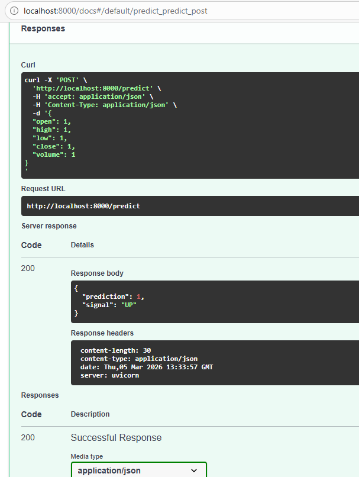
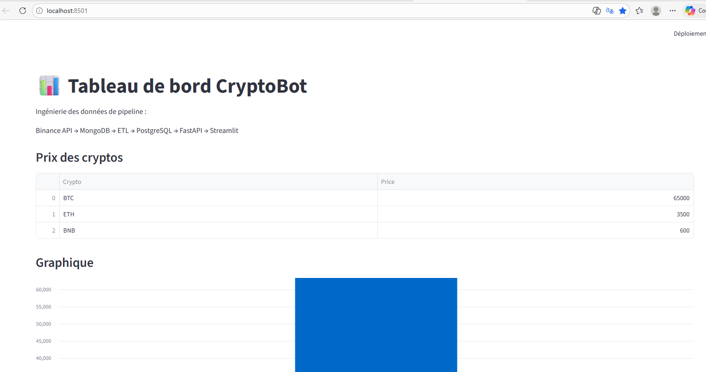
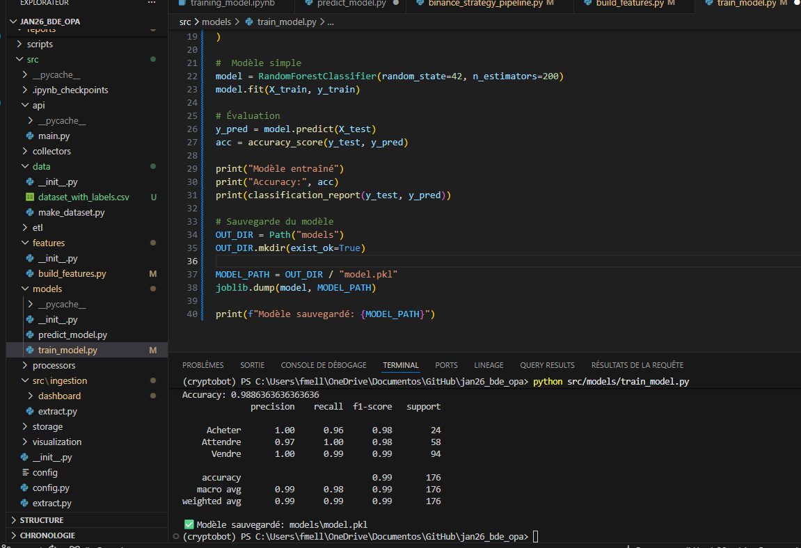
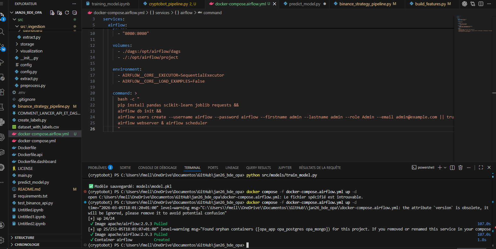
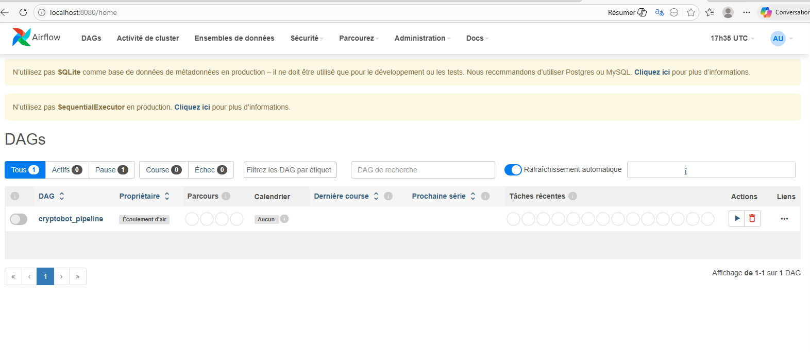
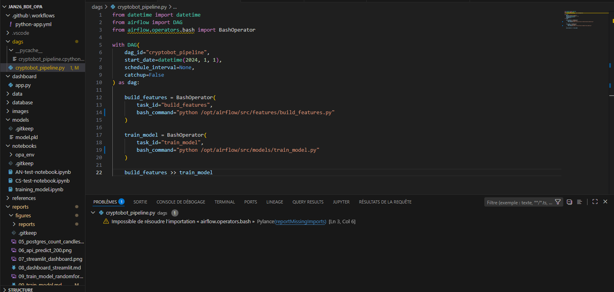

## Figures du projet CryptoBot

Dans cette partie, nous montrons les différentes captures d’écran du projet pour expliquer comment fonctionne le pipeline de données.

Le but est de montrer toutes les étapes du projet : stockage des données, API, machine learning, dashboard et orchestration.

---

### Figure 5 — Données stockées dans PostgreSQL

Cette image montre que les données ont bien été chargées dans la base de données PostgreSQL.

Cela signifie que l’ETL a fonctionné correctement et que les données de marché sont disponibles pour être utilisées dans le projet.

---

### Figure 6 — API FastAPI

Cette image montre l’API FastAPI.

L’API permet d’accéder aux données et aux prédictions du modèle de machine learning via une requête HTTP.

Cela permet à d’autres applications d’utiliser les résultats du modèle.

---

### Figure 7 — Dashboard Streamlit

Cette image montre le dashboard Streamlit.

Le dashboard permet de visualiser les données du marché et les résultats du modèle de machine learning de manière simple.

C’est l’interface utilisateur du projet.

---

### Figure 9 — Entraînement du modèle Machine Learning

Cette image montre l’entraînement du modèle RandomForest.

Le modèle apprend à partir des données historiques pour essayer de prédire si le prix du marché va monter ou descendre.

---

### Figure 10 — Démarrage d’Airflow

Cette image montre le démarrage d’Apache Airflow avec Docker.

Airflow est utilisé pour automatiser les différentes étapes du pipeline de données.

---

### Figure 11 — DAG Airflow

Cette image montre le DAG du projet dans l’interface Airflow.

Un DAG représente les différentes tâches du pipeline.

---

### Figure 12 — Orchestration du pipeline

Cette image montre le pipeline automatisé du projet.

Deux tâches principales sont exécutées :

- build_features : préparation des données
- train_model : entraînement du modèle

Airflow permet de lancer ces étapes automatiquement.

