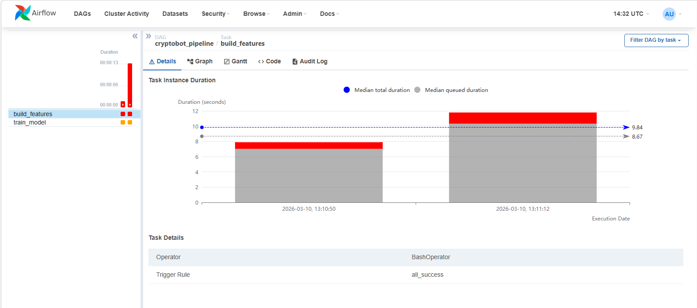

## Exécution d’une tâche dans Airflow

Cette capture montre l’exécution de la tâche **build_features** dans Apache Airflow.

Cette tâche est responsable de la préparation des données utilisées pour entraîner le modèle de machine learning.

Airflow permet de suivre l’exécution des tâches et de vérifier leur durée d’exécution.

Dans notre pipeline, cette tâche est exécutée avant la tâche **train_model**.

Si la tâche échoue, la tâche suivante ne peut pas démarrer.

Cela permet de garantir que les étapes du pipeline sont exécutées dans le bon ordre.

 le projet montre comment construire un pipeline complet de **Data Engineering et Machine Learning** :

- ingestion de données
- stockage NoSQL
- transformation ETL
- stockage SQL
- entraînement ML
- API
- dashboard
- orchestration

---

# Améliorations possibles

Plusieurs améliorations pourraient être ajoutées :

- ingestion des données en **streaming**
- ajout de **plusieurs modèles ML**
- déploiement du projet dans le **cloud**
- automatisation complète du pipeline

---