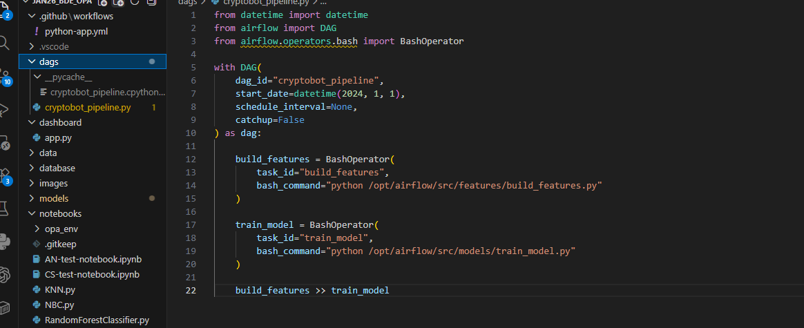

## Orchestration du pipeline avec Airflow

Le pipeline de données est automatisé à l’aide d’Apache Airflow.

Un DAG nommé `cryptobot_pipeline` orchestre les différentes étapes du traitement des données.

Les tâches exécutées sont :

- `build_features` : génération des features pour le modèle Machine Learning
- `train_model` : entraînement du modèle à partir des données préparées

La dépendance suivante garantit l’ordre d’exécution :

build_features >> train_model

Cela signifie que les features sont générées avant l'entraînement du modèle.

